## 简介

Prometheus是一个开放性的监控解决方案，用户可以非常方便的安装和使用Prometheus并且能够非常方便的对其进行扩展。为了能够更加直观的了解Prometheus Server，接下来我们将在本地部署并运行一个Prometheus Server实例，通过Node Exporter采集当前主机的系统资源使用情况。 并通过Grafana创建一个简单的可视化仪表盘。

## 一、基础环境

|  环境/组件   | 版本  |
|  ----  | ----  |
| 操作系统  | CentOS Linux release 7.6.1810 |
| Prometheus  | prometheus-2.22.1.linux-amd64.tar.gz |
| go	| go1.15.4.linux-amd64.tar.gz |
| Grafana	| grafana-7.3.3-1.x86_64.rpm |

## 二、安装Go

### 1、下载解压安装

```shell
https://golang.org/dl/
```

使用以下命令golang文件会自动下载并解压到`/swarm/go`到目录下

```shell
wget -c https://dl.google.com/go/go1.16.5.linux-amd64.tar.gz -O - | sudo tar -xz -C /swarm/
```

### 2、配置环境变量

通过将 Go 目录添加到$PATH环境变量，系统将会知道在哪里可以找到 Go 可执行文件。

```shell
vim ~/.profile
export PATH=$PATH:/swarm/go/bin
```

保存文件，并且重新加载新的PATH 环境变量到当前的 shell 会话：

```shell
source ~/.profile
```

### 3、验证

```shell
go version
```

## 三、安装Prometheus

### 1、下载、解压、设置软连接

```shell
https://prometheus.io/download/#prometheus
```

```shell
wget https://github.com/prometheus/prometheus/releases/download/v2.27.1/prometheus-2.27.1.linux-amd64.tar.gz
```

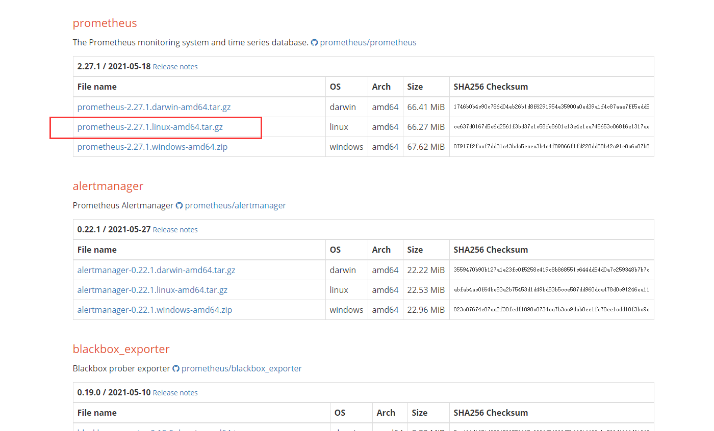

```shell
tar -xvf prometheus-2.27.1.linux-amd64.tar.gz
mv prometheus-2.27.1.linux-amd64 prometheus
```

### 2、启动

普罗米修斯默认配置文件 `/swarm/prometheus/prometheus/prometheus.yml`

- 先修改prometheus配置文件

```
vim /swarm/prometheus/prometheus/prometheus.yml
```

以下参数设置为1min

```shell
  scrape_interval:     1m # Set the scrape interval to every 15 seconds. Default is every 1 minute.
  evaluation_interval: 1m
  
  - job_name: 'prometheus'

  # metrics_path defaults to '/metrics'
  # scheme defaults to 'http'.

  static_configs:
  - targets: ['localhost:14200']
```

- 启动命令

```shell
./prometheus --config.file=/swarm/prometheus/prometheus/prometheus.yml --web.listen-address=:14200
```

- 进入会话

```shell
tmux a -t prom
```

- 设置systemctl管理

```shell
[Unit]
Description= Prometheus
After=network.target
# Type设置为notify时，服务会不断重启# User设置对应上面创建的账号
# 存储配置, 
# By default, Prometheus stores its database in ./data (flag --storage.tsdb.path).
# --storage.tsdb.path: 存储数据的目录，默认为./data
# --storage.tsdb.retention.time: 数据过期清理时间，默认保存15天
[Service]
Type=simple
User=root
ExecStart=/usr/local/Prometheus/prometheus --config.file=/usr/local/Prometheus/prometheus.yml --storage.tsdb.path=/usr/local/Prometheus/data
ExecReload=/bin/kill -HUP $MAINPID
Restart=on-failure
[Install]
WantedBy=multi-user.target
```

- 启动参数解释

```
–config.file=/etc/prometheus.yml 指定配置文件
  
–web.read-timeout=5m 请求链接的最大等待时间，防止太多的空闲链接占用资源
  
–web.max-connections=512 针对prometheus，获取数据源的时候，建立的网络链接数，做一个最大数字的限制，防止链接数过多造成资源过大的消耗
  
–storage.tsdb.retention=15d 重要参数，prometheus 开始采集监控数据后，会存在内存和硬盘中；对于保存期限的设置。时间过长，硬盘和内存都吃不消；时间太短，要查历史数据就没了。企业15天最为合适。
  
–storage.tsdb.path="/prometheus/data" 存储数据路径，不要随便定义
  
–query.max-concurrency=20 用户查询最大并发数
  
–query.timeout=2m 慢查询强制终止
```

> 注意：
> 本次启动用户是root生产中最好新建一个用户用于启动，需要设置配置文件及数据文件权限
> 数据目录在生产中最好单独配置数据硬盘，使用LVM硬盘格式配置

```shell
vim /usr/lib/systemd/system/prometheus.service
```

```shell
systemctl daemon-reload
systemctl enable prometheus.service
systemctl start prometheus.service
systemctl status prometheus.service
```

### 3、验证

浏览器打开`IP:9090`即可打开普罗米修斯自带的监控页面

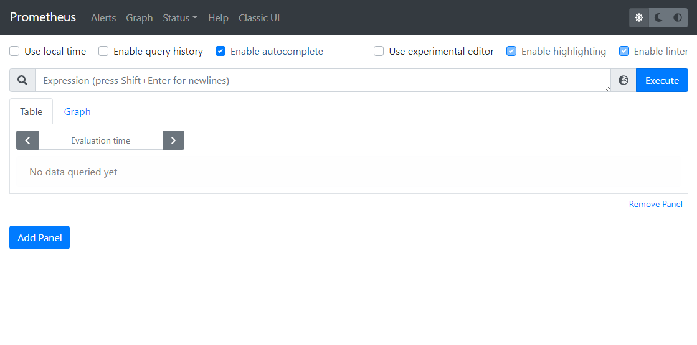

## 四、安装Grafana

Grafana是一款用Go语言开发的开源数据可视化工具，可以做数据监控和数据统计，带有告警功能。

### 1、打开官网并下载

```shell
https://grafana.com/grafana/download
```

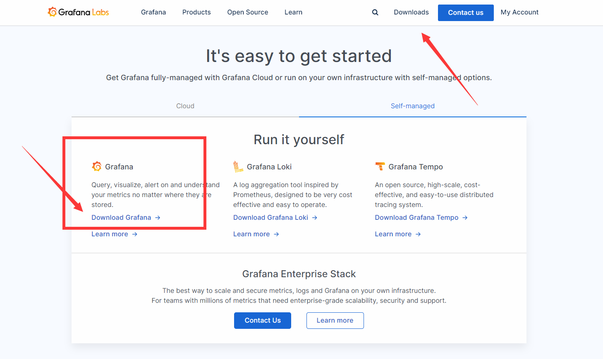

- 找到对应版本和linux内核下载


### 2、安装

- centos 方式

```shell
wget https://dl.grafana.com/oss/release/grafana-7.5.7-1.x86_64.rpm
sudo yum install grafana-7.5.7-1.x86_64.rpm
```

- ubuntu方式

```shell
wget https://dl.grafana.com/oss/release/grafana-8.0.0.linux-amd64.tar.gz
tar -zxvf grafana-8.0.0.linux-amd64.tar.gz
mv /swarm/prometheus/grafana-8.0.0 /swarm/prometheus/grafana
```

设置端口和IP

```shell
vim /swarm/prometheus/grafana/conf/defaults.ini
```

设置端口和IP

```shell
# The http port to use
http_port = 14201

# The public facing domain name used to access grafana from a browser
domain = 0.0.0.0

```

### 3、启动

```shell
tmux new -s grafana
```

- 进入会话

```shell
tmux a -t grafana
 /swarm/prometheus/grafana/bin/grafana-server --config /swarm/prometheus/grafana/conf/defaults.ini
```

```shell
/bin/systemctl daemon-reload
/bin/systemctl enable grafana-server.service
/bin/systemctl start grafana-server.service
```

### 4、访问Grafana

浏览器访问`IP:3000`端口，即可打开grafana页面，默认用户名密码都是admin，初次登录会要求修改默认的登录密码


进入后的面板

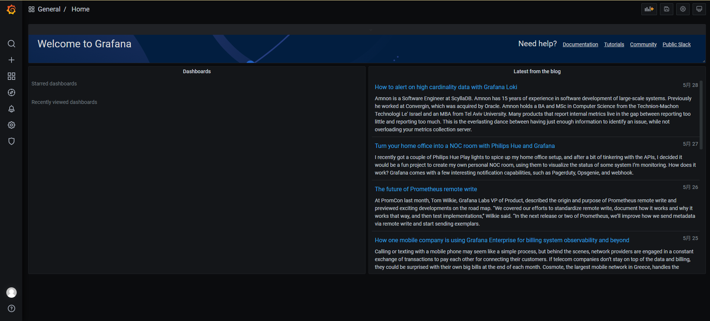

### 5、与 Prometheus 交互

- 点击 Data Sources

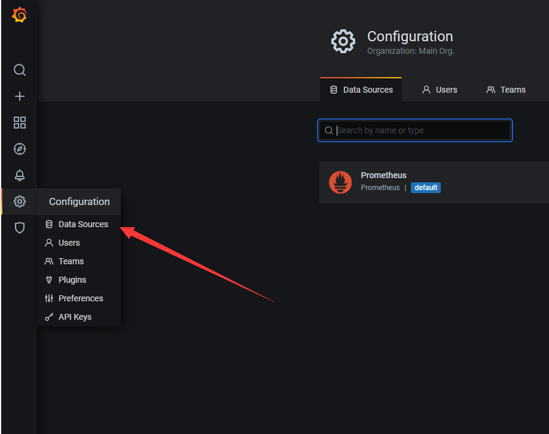

- Add Data Sources

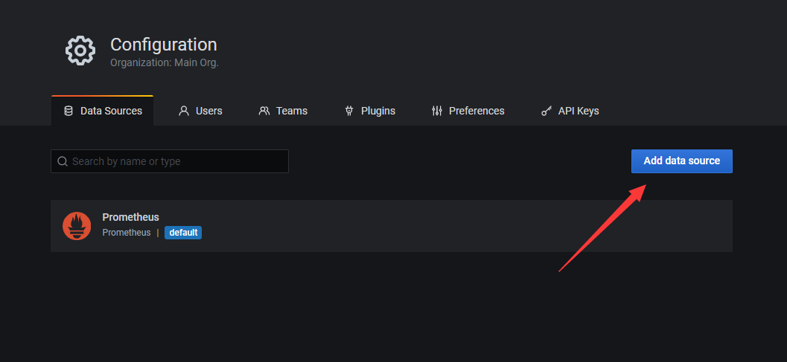

- 选择“Prometheus 2.0 Stats”

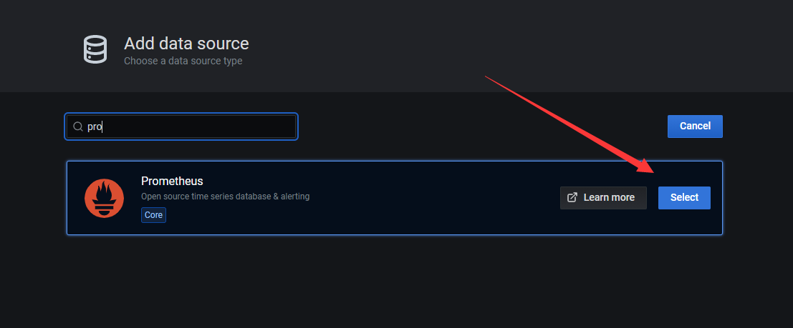

- 点击“import”按钮导入

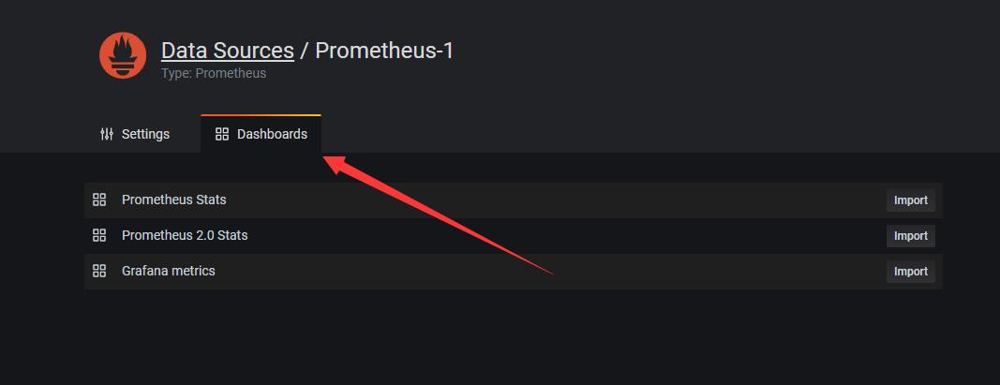

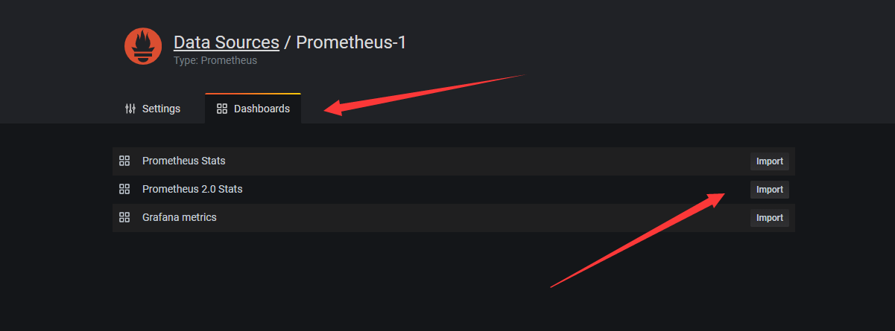

- 在Settings页面填写之前的普罗米修斯`URL`并点击保存

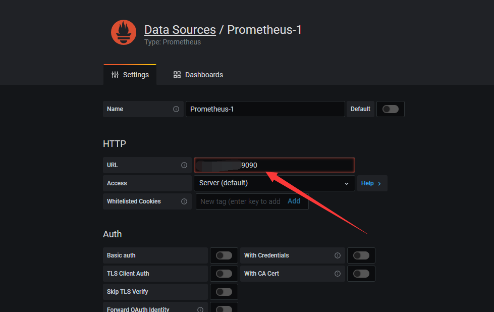

- 切换到刚才添加的“Prometheus 2.0 Stats”即可看到整个监控页面

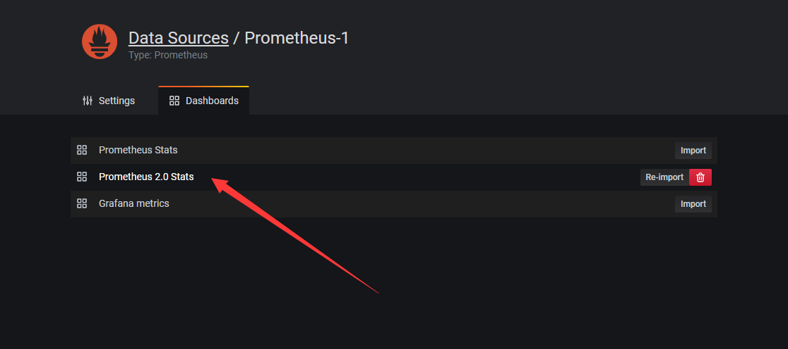

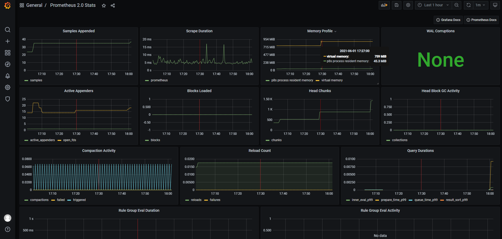

## 五、配置 Node_Exporter

### 1、下载

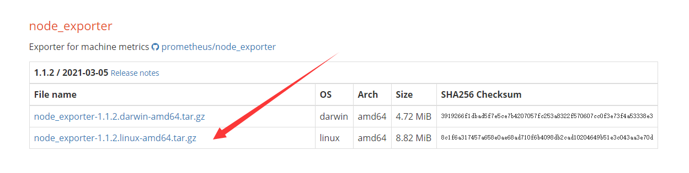

```shell
wget https://github.com/prometheus/node_exporter/releases/download/v1.1.2/node_exporter-1.1.2.linux-arm64.tar.gz
tar -xzvf node_exporter-1.1.2.linux-amd64.tar.gz
mv node_exporter-1.1.2.linux-amd64 /usr/local/Prometheus/node_exporter
```

### 2、启动

- 添加启动服务

```shell
vim /usr/lib/systemd/system/node_exporter.service
```

- 为了方便管理使用系统服务管理

```shell
[Unit]
Description=node_exporter
After=network.target

[Service]
Type=simple
User=root
ExecStart=/usr/local/Prometheus/node_exporter/node_exporter --web.listen-address=localhost:9101
ExecReload=/bin/kill -HUP $MAINPID
Restart=on-failure

[Install]
WantedBy=multi-user.target
```

```shell
systemctl daemon-reload
systemctl enable node_exporter.service
systemctl start node_exporter.service
systemctl status node_exporter.service
```

```shell
# 将node_exporter添加到Prometheus服务器
vim /usr/local/prometheus/prometheus/prometheus.yml
# 在'scrape_config'下添加node_exporter的job  - job_name: 'node_exporter'
```

### 3、重新配置 Prometheus

```shell
vim /usr/local/Prometheus/prometheus.yml
```

追加

```shell
scrape_configs:
  # The job name is added as a label `job=<job_name>` to any timeseries scraped from this config.
  - job_name: 'prometheus'

    # metrics_path defaults to '/metrics'
    # scheme defaults to 'http'.

    static_configs:
    - targets: ['localhost:9090']
#追加以下内容
  - job_name: 'node_exporter-1'
    static_configs:
    - targets: ['localhost:9101'] #安装node_exporter的服务器
```

- 重新启动

```shell
systemctl restart prometheus
```

## 六，架构图

如果要想监控，前提是能获取被监控端指标数据，并且这个 数据格式必须遵循Prometheus数据模型，这样才能识别和 采集，一般使用exporter提供监控指标数据。

- exporter列表： https://prometheus.io/docs/instrumenting/exporters

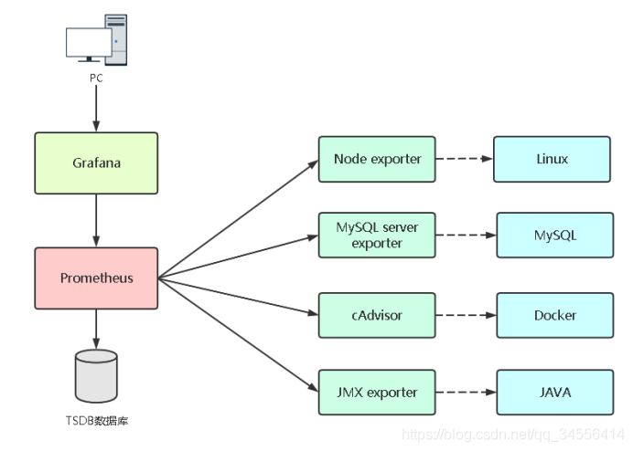

## 问题

### 1. 出现以下错误

```
错误：rpmdb: BDB0113 Thread/process 21983/140193275361280 failed: BDB1507 Thread died in Berkeley DB library
错误：db5 错误(-30973) 来自 dbenv->failchk：BDB0087 DB_RUNRECOVERY: Fatal error, run database recovery
错误：无法使用 db5 -  (-30973) 打开 Packages 索引
错误：无法从 /var/lib/rpm 打开软件包数据库
CRITICAL:yum.main:

Error: rpmdb open failed
```

解决：

```shell
#b删除/var/lib/rpm目录下的__db开头的rpmdb文件

rm -f /var/lib/rpm/__db*

# rpm数据库重建

rpm --rebuilddb

# 清理所有yum缓存

yum clean all

# 重新生成yum缓存

yum makecache
```

## 扩展

### 1、Linux 查看进程占用端口

```shell
ps aux|grep node_exporter
```

```shell
netstat -nap | grep 26608
```
