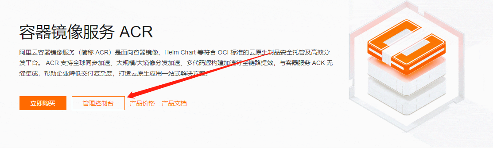
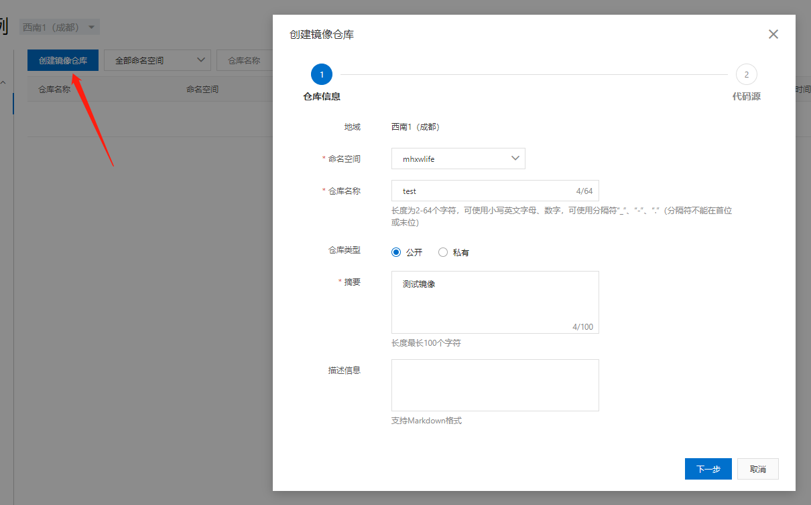
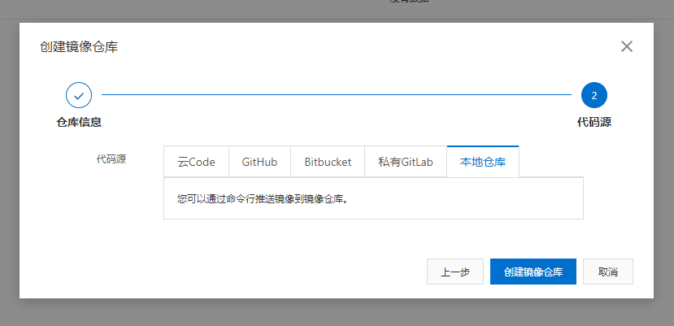
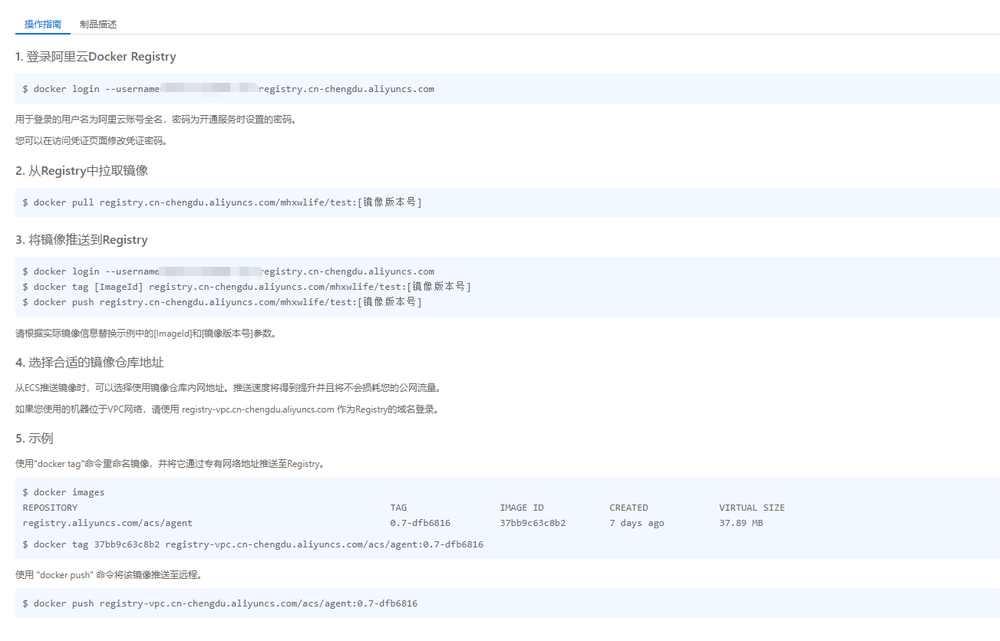

## 入门

### 1. 进入阿里云镜像官网

https://www.aliyun.com/product/acr



再点击“管理控制台”进入管理页面

### 2. 创建一个仓库





### 3. 按照指示推送镜像



### 参考文档

```shell
https://help.aliyun.com/document_detail/198212.html
https://blog.csdn.net/qq_41489540/article/details/114228545
```
